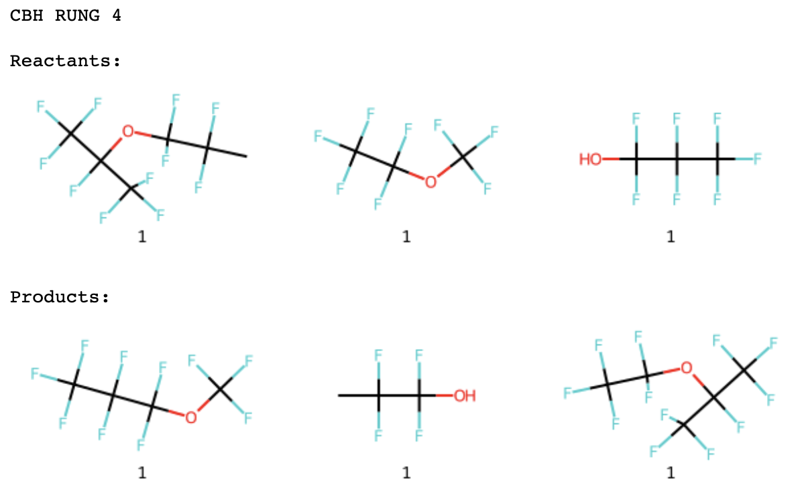
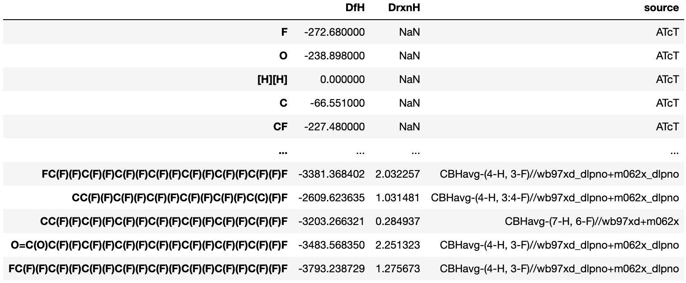
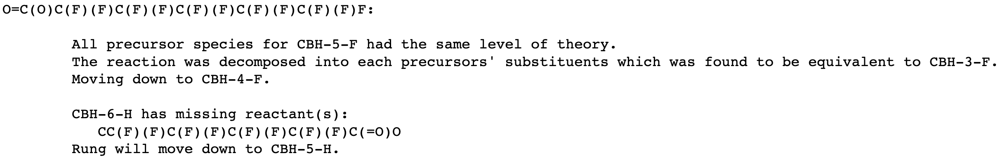
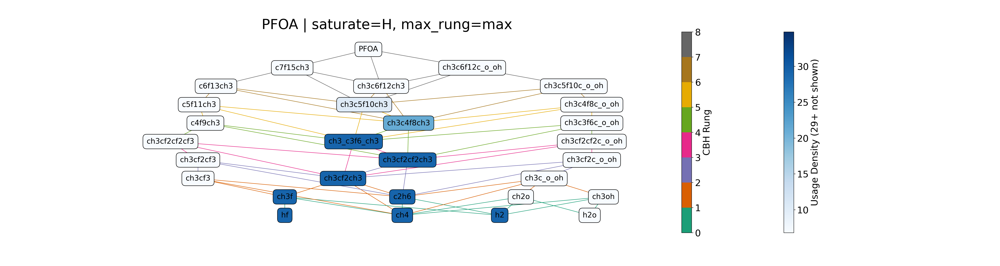
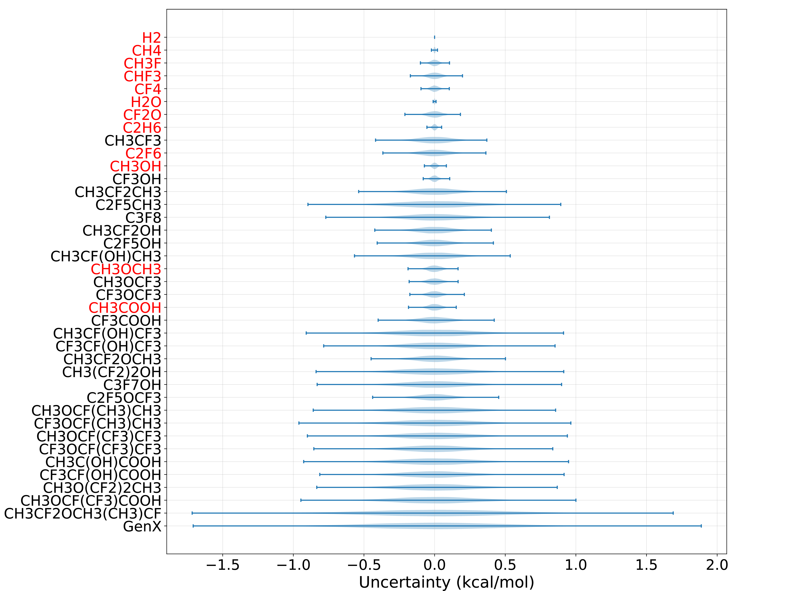

# autoCBH
Automated generation of Connectivity-Based Hierarchies (CBH) for selected molecules. Using these schema, heats of formation can be computed at higher accuracy. This package automates the whole process of this calculation once the neccessary experimental heats of formation and quantum mechanical energies are compiled by the user. This package is specifically novel in its ability to generate and compute heats of formation using combinations of different saturation schemes.


A tutorial for the most useful features is provided in the ```examples/autoCBH Tutorial.ipynb``` notebook.
A more in-depth description of the package can be found in this [Master's Thesis](https://repository.library.brown.edu/studio/item/bdr:t638etqc/). This package was used used in the following publications:
* Bjarne Kreitz, Kento Abeywardane, and C. Franklin Goldsmith. **Linking Experimental and _Ab Initio_ Thermochemistry of Adsorbates with a Generalized Thermochemical Hierarchy.** Journal of Chemical Theory and Computation. 2023. 19 (13), 4149-4162. DOI: [10.1021/acs.jctc.3c00112](https://doi.org/10.1021/acs.jctc.3c00112)

## Table of Contents
1. [Installation Instruction](#installation-instructions)
2. [File Structure](#file-structure)
3. [Features](#features)

## Installation Instructions
### 1. Clone repo
Clone the repository and move into the autoCBH directory.

### 2. Setup and activate environment
Setup the python environment then activate it with the following command.

```
conda env create -f environment.yml
conda activate autocbh
```
Note, this defaults to RDKit 2022.09 where the $\texttt{CanonSmiles}$ algorithm changed from RDKit 2022.03.5. 

\[OPTIONAL\] To adjust RDKit version, either edit the ```environment.yml``` file to this version. Alternatively, use the following command:

```
conda create -n autocbh python=3.9 numpy=1.23 pandas=1.4 rdkit=2022.03.5 python-igraph=0.9.11 pygraphviz=1.9 networkx notebook matplotlib pytest tqdm pyyaml -c defaults -c conda-forge -c anaconda
```

### 3. Perform a developer install
Perform a developer install once inside the autoCBH directory.
```
cd autocbh
python -m pip install -e .
```

## File Structure
```
.
├── autocbh/                        # autoCBH module
│   ├── data/                       
│   │   └── molData.py              # data processing/handling file
│   ├── calcCBH.py                  # hierarchical calculation of HoF
│   │   └── calcCBH                 
│   ├── CBH.py                      # CBH schema generation
│   │   └── buildCBH                
│   ├── hrxnHelpers.py              # customizable funcs for QM-specific Hrxn calc
│   ├── TN.py                       # thermochemical network generation
│   │   └── thermochemical_network
│   └── UQ.py                       # uncertainty quantification/propagation
│       └── uncertainty_quantification 
├── data/                           # raw data and configuration files
│   ├── *.pkl                       # default raw data (QM and experimental)
│   ├── methods_keys.yaml           # dictionary for QM method names
│   ├── rankings.yaml               # rankings of accuracy of QM methods
│   ├── alternative_rxn.yaml        # custom reaction schemes
│   └── alias.yaml                  # custom names for SMILES strings
├── examples/                       # ipynb examples / tutorials
│   └── autoCBH Tutorial.ipynb      
└── tests/                          # tests for pytest
```


## Features
### 1. Automated CBH scheme generation


### 2. Automated calculation of heats of formation across multiple levels of theory


### 3. Error logging during calculation


### 4. Thermochemical network visualization


### 5. Uncertainty propagation quantification



## Acknowledgements and Copyright
Copyright (c) 2022, [Goldsmith Group for Chemical Kinetics](https://www.brown.edu/Departments/Engineering/Labs/Goldsmith/index.html), [Brown University](https://engineering.brown.edu/)

Author: Kento Abeywardane

Setup configuration and TOML files using [MolSSI cookiecutter](https://github.com/molssi/cookiecutter-cms)
